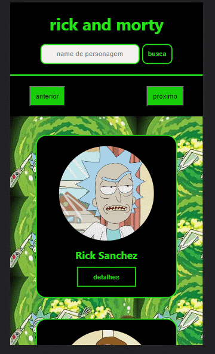

<h1 style="text-align: center">Rick And Morty</h1>

 

link <a href="https://rick-and.vercel.app/">https://rick-and.vercel.app/</a>

<h2 style="margin-top: 20px">Tecnologias</h2>
<ul>
  <li>react-router-dom</li>
  <li>react toastify</li>
  <li>Axios</li>
</ul>

<h2 style="margin-top: 20px">Funcionalidades</h2>
<ul>
  <li>Pesquisa</li>
  <li>detalhes</li>
  <li>paginação</li>
  <li>personagens principais</li>
</ul>

<h2 style="margin-top: 20px">Como Rodar</h2>
<ul>
   <li>git clone https://github.com/isaac545454/rick</li>
   <li>yarn intall(baixar o node_modules)</li> 
   <li>yarn dev(rodar o projeto)</li> 
</ul>
